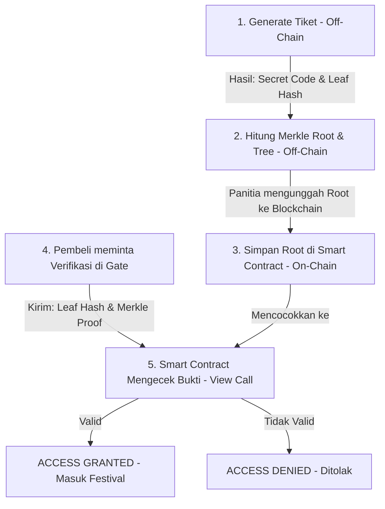

# Penjelasan Konsep & Alur Kerja DApp KarsaFest

Dokumen ini menjelaskan tujuan arsitektur dan alur kerja singkat dari sistem tiketing pentas seni **KarsaFest** yang memanfaatkan teknologi **Smart Contract** dan **Merkle Tree**.

---

## 1. Tujuan Konsep (Why Merkle Tree & Anonymous Ticketing?)

Biasanya, sistem tiket berbasis blockchain konvensional mencatat setiap tiket sebagai token unik (seperti NFT) yang terikat langsung pada alamat dompet (*wallet address*) pembeli. Hal ini memiliki beberapa kelemahan:
* **Privasi Rendah**: Siapa pun dapat melihat dompet mana yang memiliki tiket apa, merusak anonimitas pembeli di festival seni.
* **Biaya Gas Tinggi**: Menulis puluhan ribu data tiket satu per satu ke blockchain membutuhkan biaya gas (*gas fee*) yang sangat mahal untuk panitia.

**KarsaFest** memecahkan masalah ini dengan konsep **Merkle Tree**:
1. **Privasi Mutlak (Anonymous)**: Pembeli membuktikan kepemilikan tiket di gerbang masuk menggunakan bukti kriptografi (*Merkle Proof*). Panitia dan blockchain tidak pernah mengetahui nama pembeli atau kode rahasia tiket mereka, melainkan hanya memverifikasi keabsahan bukti tersebut.
2. **Optimalisasi Gas (Highly Scalable)**: Panitia tidak perlu menyimpan ribuan data tiket di blockchain. Panitia hanya perlu menyimpan **satu buah nilai data 32-byte** yang disebut **Merkle Root** di Smart Contract. Nilai tunggal ini mewakili ribuan tiket yang sah secara aman.

---

## 2. Alur Singkat Verifikasi (Workflow)

### Langkah 1: Registrasi Tiket (Off-Chain)
* Pembeli melakukan registrasi atau pembelian tiket. Sistem meng-generate kode rahasia tiket (misal: `KRS-VIP-ALICE-1234`).
* Kode rahasia di-hash menggunakan algoritma **Keccak-256** menjadi sebuah **Leaf Hash**.

### Langkah 2: Pembangunan Pohon Merkle (Off-Chain)
* Panitia mengumpulkan semua *Leaf Hash* dari tiket yang terjual secara off-chain.
* Semua *Leaf Hash* dipasangkan dan di-hash secara berulang hingga menyisakan satu hash tunggal di puncak pohon, yang disebut **Merkle Root**.

### Langkah 3: Publikasi Root (On-Chain)
* Panitia mengirimkan nilai **Merkle Root** tersebut ke Smart Contract `KarsaTix.sol` melalui fungsi `updateMerkleRoot(bytes32 _newRoot)`. Langkah ini hanya dilakukan sekali oleh panitia untuk seluruh tiket yang terdaftar.

### Langkah 4: Gate Check-in & Pembuktian (On-Chain/Gasless)
* Saat masuk festival, pembeli menyerahkan **Leaf Hash** tiketnya beserta **Merkle Proof** (jalur sibling dari leaf menuju root) ke sistem Gate Panitia.
* Sistem Gate memanggil fungsi `verifyTicket(proof, leaf)` pada Smart Contract.
* Smart contract akan menghitung ulang hash dari *Leaf* menggunakan *Merkle Proof* yang diberikan. Jika hasil akhir perhitungan cocok dengan *Merkle Root* yang disimpan di blockchain, maka tiket dinyatakan **VALID** secara instan dan tanpa biaya gas (*gasless read*).

---

## 3. Keunggulan Sistem Ini

* **Zero-Knowledge Vibe**: Anda membuktikan bahwa Anda memiliki tiket yang sah tanpa perlu memberi tahu panitia kode rahasia tiket Anda.
* **Double Spend Prevention**: Sekali sebuah *Leaf Hash* digunakan untuk check-in, panitia dapat menandainya sebagai "sudah digunakan" secara lokal agar tiket tidak bisa digunakan dua kali oleh orang lain.
* **Keamanan Kriptografis**: Karena sifat hash satu arah, siapa pun tidak akan bisa menebak kode rahasia tiket orang lain meskipun mereka mengetahui seluruh *Leaf Hash* di dalam daftar.
